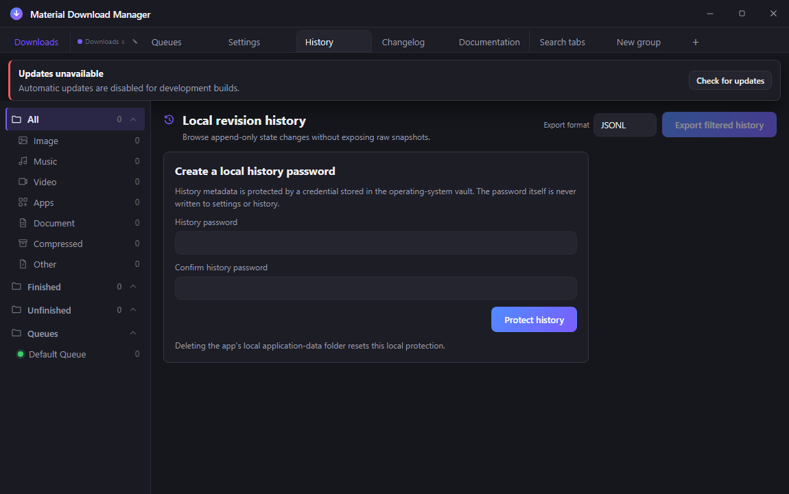
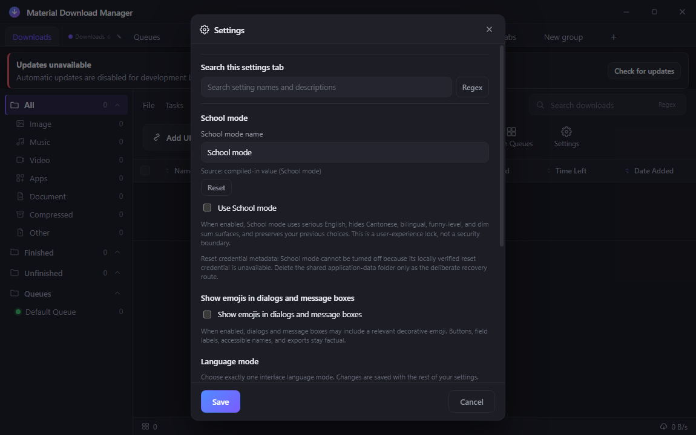
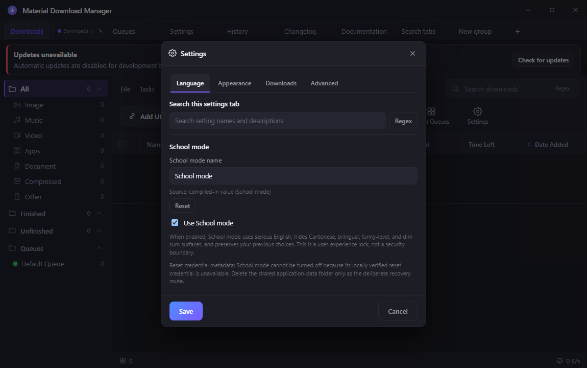
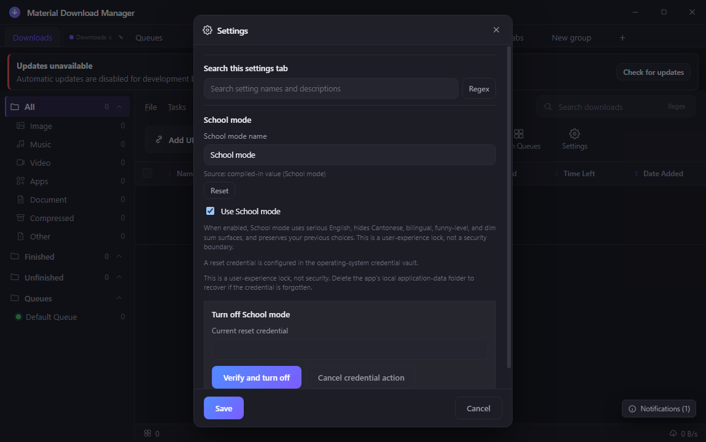
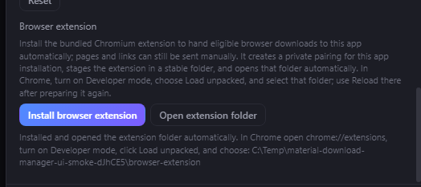

# Material Download Manager

Material Download Manager is a Windows Electron download manager ported from the
AB Download Manager codebase.

## Quick index

- Runnable app: [`design/`](design/)
- Preserved visual prototype: [`prototype/`](prototype/)
- Handoff: [`HANDOFF.md`](HANDOFF.md)
- Roadmap: [`ROADMAP.md`](ROADMAP.md)
- Changelog: [`CHANGELOG.md`](CHANGELOG.md)
- CI and release contract: [`CI.md`](CI.md)
- Shared project guidance mirror: [`AGENTS.md`](AGENTS.md)
- Release workflow: [stable Windows release](.github/workflows/release.yml)
- GitHub Pages source: [`site/`](site/)
- Live site: [Material Download Manager on GitHub Pages](https://ding-ding-projects.github.io/material-download-manager/)
- Latest stable release: [view the latest stable GitHub Release](https://github.com/Ding-Ding-Projects/material-download-manager/releases/latest)
- Fresh-machine build: [`build.bat`](build.bat) and [`build-installer.bat`](build-installer.bat)
- Fresh-machine build docs: [`docs/features/build/`](docs/features/build/)
- Chromium extension: [`extension/`](extension/) — catches eligible browser downloads automatically by default through an app-prepared authenticated pairing and is packaged with every stable release as the versioned source/reference ZIP `material-download-manager-extension-<version>.zip`; use **Install browser extension** in the app, then choose its automatically opened paired folder with **Load unpacked** at `chrome://extensions`
- Search feature docs: [`docs/features/search/`](docs/features/search/)
- Navigation feature docs: [`docs/features/navigation/`](docs/features/navigation/)
- Website: [ding-ding-projects.github.io/material-download-manager](https://ding-ding-projects.github.io/material-download-manager/)
- Export feature docs: docs/features/export/
- History feature docs: docs/features/history/
- Accessibility feature docs: docs/features/accessibility/
- Notification feature docs: docs/features/notifications/
- Safety feature docs: docs/features/safety/
- Settings feature docs: docs/features/settings/
- Download engine docs: docs/features/download-engine/
- Browser handoff docs: [`docs/features/integrations/browser-extension.md`](docs/features/integrations/browser-extension.md)
- Progress-window docs: [`docs/features/download-engine/progress-window.md`](docs/features/download-engine/progress-window.md)
- Auto-organize docs: [`docs/features/download-engine/auto-organize-downloads.md`](docs/features/download-engine/auto-organize-downloads.md)
- Distributed SSH worker docs: [`docs/features/download-engine/distributed-ssh-workers.md`](docs/features/download-engine/distributed-ssh-workers.md)
- In-app documentation docs: [`docs/features/documentation/in-app-documentation-browser.md`](docs/features/documentation/in-app-documentation-browser.md)
- Protected display-name history: [`docs/features/history/display-name-mutation-history.md`](docs/features/history/display-name-mutation-history.md)

<details>
<summary>Auto-organize screenshot gallery</summary>

These captures come from the real built Electron renderer on a disposable
cheap hidden desktop. The displayed base path was deliberately set to the
generic `C:\Downloads` before capture. Commit
`92dc67a17fbad4f7471cda5d7d85c1b4b78c44a5` was rebuilt with `npm run build`,
and the verified 2026-08-11 capture run passed all 42 required
built-application checks in 10.488 seconds. Its renderer emitted
`index-CUWEWH76.js` (SHA-256
`34EF8CF409C1C6B5248E7F345CC9F2F58BD17C1A8022014D275C220F448FFCCC`)
and `index-CL9UO5Fq.css` (SHA-256
`23FF81988A28774B46E99E5FC38739905D813F8E7098D218325B9AC7974A0D45`).
Six gallery frames are 1100 × 900 and the narrow frame is 520 × 760; every
image decodes as a 24-bit PNG with a unique SHA-256 hash. The exact disposable
process tree, profile, and hidden desktop were removed after the run.

### Six future category paths


### Ordered custom-rule editor


### Anchored regex-only builder


### Inline validation and blocked Save


### Narrow 520 CSS-pixel anchored builder


### Bilingual mode


### Exact command-palette destination


</details>

<details>
<summary>Protected History surface</summary>

The real built desktop capture below shows the first-run History protection
surface: password setup, the operating-system vault explanation, the local-data
folder reset route, and the disabled export action while the tab is locked.



This 1150×720 PNG came from the hidden-desktop/CDP capture route at the source
commit documented in [`HANDOFF.md`](HANDOFF.md). SHA-256:
`53DBA85C6FED4704995D5D6D7893F3A51590A6A942E870FE6B074E6F9A5C2361`.

</details>

<details>
<summary>School mode and dialog emoji settings</summary>

The shared presentation settings are owned by the main process and persisted
in the normal local application-data record. This real built-artifact capture
comes from source commit `ecf9bc65e6f78f08e109abfbed5aa897cbdbb86d`, rebuilt
with `npm run build` from the `design/` directory, and driven on a
named hidden desktop. The renderer assets were `index-9-ppiL__.js` (SHA-256
`AB1C07E2AF56D3A24E084D7EA04FAEBBAA11F6A114816B27B2D41A3149B0732B`) and
`index-CL9UO5Fq.css` (SHA-256
`23FF81988A28774B46E99E5FC38739905D813F8E7098D218325B9AC7974A0D45`). Both
captures are 1150 × 720 PNGs and were inspected after capture.





The first capture SHA-256 is
`AAC74504311B2B795C8D8FD479750E938E6FB07C042E643DBAC606B60D9E94A8`; the
second is
`60A93B232437B6C9FDE4F38FB9CB6DBD6A554C1FF33204FFCC771EF03E206BED`.
School mode forces English and serious copy, preserves prior choices, removes
playful/dim-sum surfaces, and fails closed when reset credential metadata is
not locally verified. Emoji is decorative only and never enters accessible
names or exports.

</details>

<details>
<summary>School-mode reset credential</summary>

Commit [`3b76509c684a2fc5c795d92400e10cd803c511e3`](https://github.com/Ding-Ding-Projects/material-download-manager/commit/3b76509c684a2fc5c795d92400e10cd803c511e3)
adds the real shared School-mode reset credential path. Enrollment, change,
reset, and turn-off verification run through trusted main-process IPC. The
operating-system credential vault stores only a salted scrypt verifier; the
password never enters settings state, local history, exports, logs, renderer
state, or screenshots. Metadata propagates live to both application windows,
and a deleted app-data profile removes an orphaned verifier before a new setup.
Follow-up hardening commit
[`40fc29123da0c8b83c13176ab4ba526a4d5dcbd8`](https://github.com/Ding-Ding-Projects/material-download-manager/commit/40fc29123da0c8b83c13176ab4ba526a4d5dcbd8)
rejects every direct renderer disable attempt, rolls metadata back when its
settings write fails, and scrubs verifier validation buffers.



This 1150×720 capture came from the real built desktop surface through the
cheap hidden-desktop route. SHA-256:
`1BA68A701556A1957756722A022B6708B32F8D0CAB1C2E71065B5C1DB96F24C1`.

The local Chuts for this slice are `npm run docs:bundle:check`,
`npm run typecheck`, `npm run build`, `npm run test:docs` (**2/2**),
`npm run test:electron` (**104/104**), and `npm run test:engine`
(**100/100** after hardening). TOTP locks, schedules, narration, appearance editors, signing,
and CRX artifacts remain outside this slice.

</details>

<details>
<summary>Browser extension automatic capture and installation</summary>

The Manifest V3 extension requests Chrome's `downloads` permission and enables
automatic capture by default. When Chrome creates an eligible HTTP(S)
download, the service worker pauses that browser download and records that it
owns the pause. It first sends only a nonce to `GET /v2/challenge`; the app must
prove the app-prepared pairing with HMAC-SHA-256 before the extension sends any
download URL. The authenticated one-use POST is successful only after the app
proves the source with a credential-free ranged GET, durably persists and
starts the manager record, and returns an authenticated final `202`. Only then
does the extension cancel the original browser download and erase its cancelled
history row. An unpaired copy, rejection, overload, invalid proof, source-read
failure, client-disconnect rollback, timeout, offline app, or local processing
failure resumes and retains the exact download the extension paused. Manual
popup and context-menu handoffs remain available.

Automatic handoff sends the credential-free URL and, when one can be derived
safely, a basename from the URL path. It never forwards cookies,
authorization headers, referrers, browser request headers, or the absolute
browser download path. Query-bearing URLs that the app accepts persist only in
the operating-system credential vault, are redacted from ordinary state and
history, and are removed on terminal cleanup. The persisted **Automatically
send browser downloads to the local manager** option can turn this behavior off
without removing manual handoff actions.

The desktop app's **Install browser extension** action creates the paired
private copy in its stable application-data folder: the app-side capability is
kept in the operating-system credential vault and its match is written only to
that staged extension. The app automatically opens the exact folder. The
existing **Open extension folder** action remains available if the file manager
could not be opened or the folder needs to be shown again. Chrome still
requires **Developer mode → Load unpacked** for this off-store installation.



This is a fresh built-artifact crop of the install-and-reveal card. The
temporary staging path uses a generic system temporary folder so no user name
is present in the published image. It came from the same landed 42/42 smoke
run as the gallery; the 524×233 PNG has SHA-256
`B465ABCB5A4B4BBB605B5289A27E75BF2DB473408481C1AE32EEB9997BE08785`.

Each stable extension ZIP receives the reserved release version in its staged
`manifest.json`. Packaging validates that the archive has its manifest and
manifest-referenced entry points at the archive root, requires the pairing
module to be empty, rejects embedded capabilities and signing material, and
records the ZIP's size and SHA-256 for publication verification. The generic
ZIP is versioned source/reference material until the app prepares a private
paired copy; loading it directly into a fresh profile reports an unpaired
state. The project does not publish a `.crx`: a genuine CRX3 is a signed
container, while this repository permanently prohibits signing keys and
signing operations. Renaming a ZIP would not make a valid CRX, and ordinary
off-store Chrome installations still require an unpacked extension unless an
administrator has configured an enterprise installation policy.

</details>

<details>
<summary>Build and test</summary>

The root entry points are the supported fresh-machine path. They install the
declared user-scoped toolchain and project packages, refresh the current
process `PATH`, build the real renderer and main process, and report exact
failures. Use `/s` (or `--silent`, `SILENT=1`, or `MDM_BUILD_SILENT=1`) for a
touchless run from any working directory:

```powershell
build.bat /s
build-installer.bat /s
```

`build-installer.bat` reuses the application build, invokes the supported
unsigned Squirrel.Windows helper and validator, and reports the source commit,
artifact paths, sizes, SHA-256 digests, and `NotSigned` status. It never tags,
publishes, uploads, signs, generates a CRX, or opens an installer. The complete
contract, bootstrap routes, failure behavior, and focused fixture check are in
[`docs/features/build/fresh-machine-build.md`](docs/features/build/fresh-machine-build.md).

From `design/`:

```powershell
npm install
npm run docs:bundle:check
npm run test:docs
npm run typecheck
npm run build
npm run build:electron
npm run test:engine
npm run test:electron
npm run test:ui
```

The Windows packaging command is `npm run dist:win`; the committed application
manifest still describes the application target. The stable release workflow
uses the dedicated unsigned packaging helper because code signing is
prohibited. The helper restores the source manifest byte-for-byte, and the
artifact validator requires an intentionally unsigned `Setup.exe`,
`RELEASES`, every full and delta `.nupkg`, and matching package references.

Local checks run before a change is pushed. GitHub Actions deliberately runs no
tests, lint, type checking, static analysis, coverage, accessibility checks, or
screenshots. The accepted tradeoff is that automated publication does not
protect users from a commit whose local checks were skipped or failed; the
repository therefore records the real local result in the task handoff and
release notes.

The `stable Windows release` workflow builds the application, reserves a
monotonic unique version and public dim-sum code name, then creates one stable,
non-draft release with `isPrerelease=false`, release timing, the line-count table,
the validated Squirrel assets, and a version-stamped validated Chromium
extension ZIP. It has no signing credentials or alternate distribution path.
The historical unsigned test release
[`v0.1.0`](https://github.com/Ding-Ding-Projects/material-download-manager/releases/tag/v0.1.0)
is retained as prior evidence only. The latest implementation verification
release is [`v0.1.33`](https://github.com/Ding-Ding-Projects/material-download-manager/releases/tag/v0.1.33),
published from `0050941cd34005b29ab4f31368101c3a9c5de4a6` with `Setup.exe`,
`RELEASES`, and the full Squirrel package. The published record is stable,
non-draft, non-prerelease, and unsigned. The latest-release link above is
deliberately dynamic because every successful push creates a new monotonic
stable record.

The active workflows use the pinned GitHub-hosted Windows image documented in
[`CI.md`](CI.md). The release job bootstraps its declared application and
packaging dependencies; the Pages job builds the dependency-free site and
publishes only verified release metadata. Safe evidence collection runs even
after an earlier build or publication failure without changing that failure's
result.

The updater has a stable default feed at
`https://github.com/Ding-Ding-Projects/material-download-manager/releases/latest/download/`;
`MDM_UPDATE_FEED_URL` remains an optional main-process override. The historical
unsigned `v0.1.0` test release is excluded from the stable feed. A new stable
feed result was verified by the historical self-hosted release run that
published `v0.1.18`; later successful runs advance the same feed without
recycling a tag.

The release workflow runs on every push and on manual dispatch. It builds,
packages, publishes, and verifies a unique release; it does not run tests or
lint. The Pages workflow builds and deploys the documentation site from `main`
and on manual dispatch.

</details>

<details>
<summary>Repository layout</summary>

`design/` contains the runnable Electron application: the real download engine,
main-process IPC, preload bridge, React renderer, persistence, and engine tests.

`prototype/` preserves the earlier Material Design prototype, its custom
template runtime, screenshots, and reference assets. It is intentionally
separate from the production build so the prototype cannot be mistaken for the
network-backed application or silently replace it.

</details>

<details>
<summary>Current scope and next work</summary>

The handoff reconciles the two previously conflicting trees without discarding
either one. The Electron app now has a real add/probe/segmented-download,
pause/resume, persistence, queue, schedule-clock, header, timeout, settings,
notification, accessibility, safety, search, navigation, export, a browsable
local-history tab, loopback browser handoff, and a separate progress window.
The Settings dialog now has four persisted browser-style tabs with independent
search builders. Its Downloads tab requires an absolute Windows default folder,
previews six category paths, and manages an accessible first-match rule list
without moving existing files or overriding an explicitly selected folder.
Turning folder routing off keeps future default-folder downloads flat while the
rules continue to classify sidebar items. Every user-authored regular
expression—including Add download category preview and final routing—runs
through bounded IPC in a terminable main-process worker; timeouts fail safely
instead of blocking the renderer or Electron event loop. Settings schema v3
validates exact bounded rule records and preserves truthful per-key provenance.
The Chromium extension sends validated page or link URLs through a protocol-2
loopback pairing and automatically catches eligible browser downloads by
default. It pauses before handoff, requires the app to prove its capability
before any download URL is sent, and cancels/erases the browser copy only after
an authenticated final durable acceptance. Every unpaired, rejected, offline,
overloaded, invalid, source-unreadable, disconnected, or timed-out route resumes
and retains its own paused browser item. The automatic payload is limited to a
credential-free URL plus an optional URL-derived safe basename. Protected
query URLs persist only in the operating-system credential vault and are
removed on terminal cleanup. The desktop app prepares a paired extension,
automatically opens the exact staged folder, and retains a manual reveal
action. The generic release ZIP contains no pairing capability and remains a
validated versioned source/reference artifact. A live accepted handoff joins
the same queue the progress window displays. The prototype is never presented
as the download path. The app also
ships an offline Documentation tab that bundles every
categorized feature article, renders Markdown safely, keeps relative article
links inside the app, and provides its own anchored regex search. Remaining
release and product gaps are explicit in [`HANDOFF.md`](HANDOFF.md). The
published site is the live documentation and installer entry point; its runtime
manifest is injected from the latest verified stable release by the Pages
workflow. The v0.1.18 deployment was checked through the live
renderer, including its About publication state and installer link.

</details>

## Shared guidance

[`AGENTS.md`](AGENTS.md) is a sanitized mirror of the shared agent and
contributor guidance. Edit the canonical instructions source rather than this
mirror when changing that policy.
