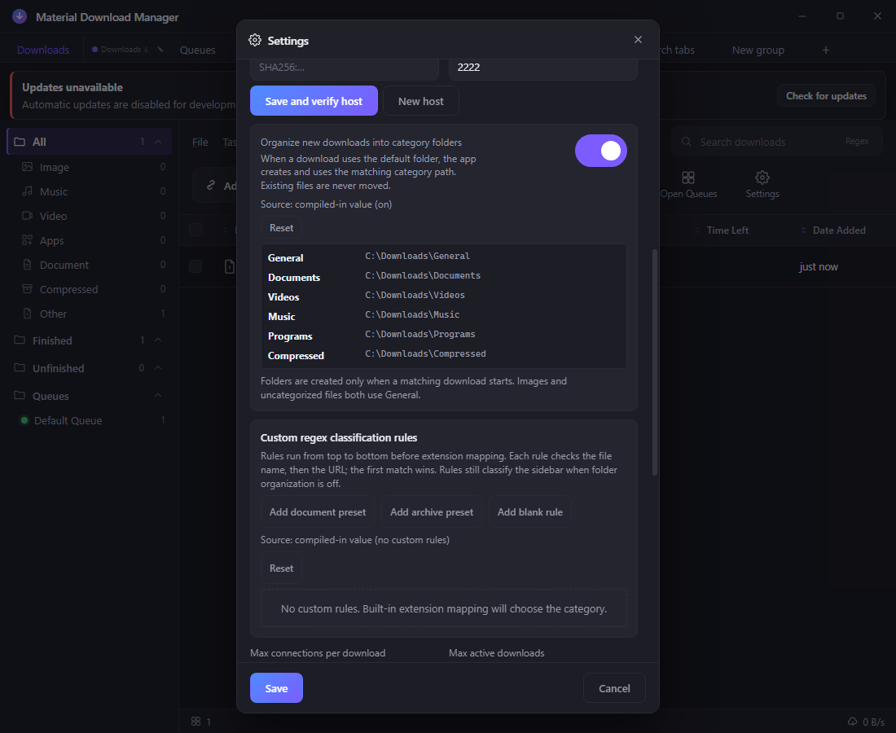
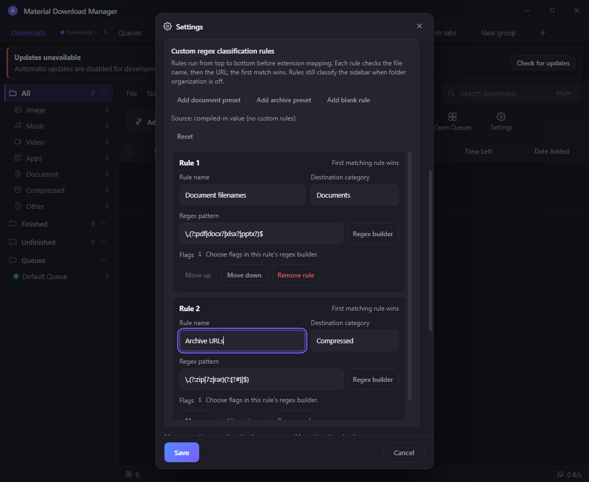
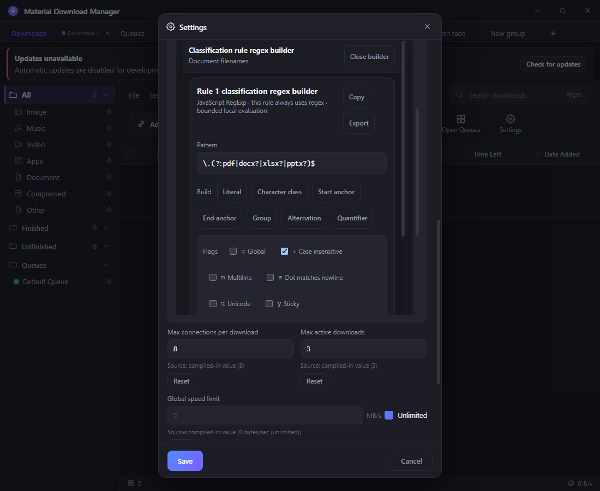
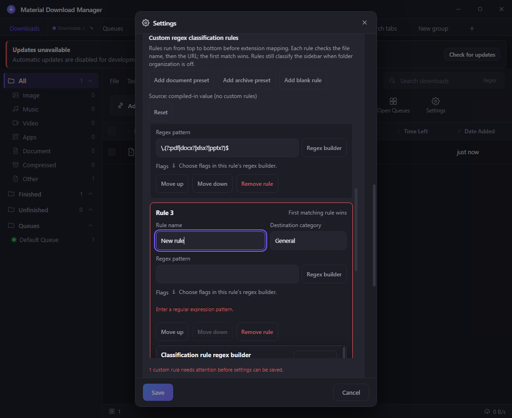
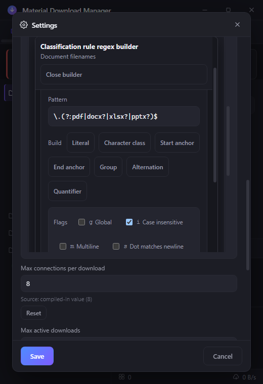
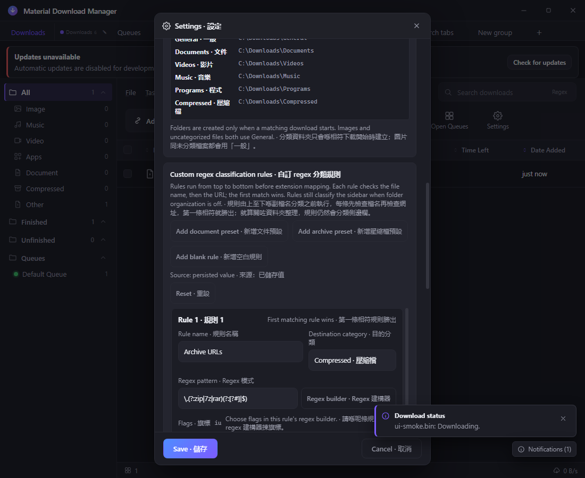
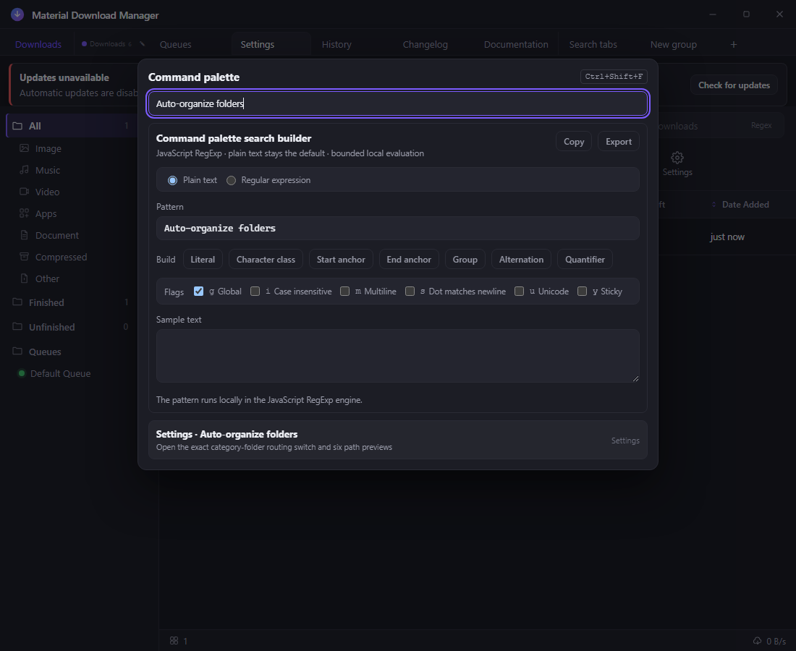

# Material Download Manager

Material Download Manager is a Windows Electron download manager ported from the
AB Download Manager codebase.

## Quick index

- Runnable app: [`design/`](design/)
- Preserved visual prototype: [`prototype/`](prototype/)
- Handoff: [`HANDOFF.md`](HANDOFF.md)
- Roadmap: [`ROADMAP.md`](ROADMAP.md)
- CI and release contract: [`CI.md`](CI.md)
- Shared project guidance mirror: [`AGENTS.md`](AGENTS.md)
- CI workflow: [Windows verification](.github/workflows/ci.yml)
- Release workflow: [stable Windows release](.github/workflows/release.yml)
- GitHub Pages source: [`site/`](site/)
- Live site: [Material Download Manager on GitHub Pages](https://ding-ding-projects.github.io/material-download-manager/)
- Latest stable release: [view the latest stable GitHub Release](https://github.com/Ding-Ding-Projects/material-download-manager/releases/latest)
- Chromium extension: [`extension/`](extension/) — packaged with every stable release as `material-download-manager-extension-<version>.zip` on the [latest release](https://github.com/Ding-Ding-Projects/material-download-manager/releases/latest); extract it and use **Load unpacked** at `chrome://extensions`
- Search feature docs: [`docs/features/search/`](docs/features/search/)
- Navigation feature docs: [`docs/features/navigation/`](docs/features/navigation/)
- Website: [ding-ding-projects.github.io/material-download-manager](https://ding-ding-projects.github.io/material-download-manager/)
- Export feature docs: docs/features/export/
- History feature docs: docs/features/history/
- Accessibility feature docs: docs/features/accessibility/
- Notification feature docs: docs/features/notifications/
- Safety feature docs: docs/features/safety/
- Settings feature docs: docs/features/settings/
- Download engine docs: docs/features/download-engine/
- Browser handoff docs: [`docs/features/integrations/browser-extension.md`](docs/features/integrations/browser-extension.md)
- Progress-window docs: [`docs/features/download-engine/progress-window.md`](docs/features/download-engine/progress-window.md)
- Auto-organize docs: [`docs/features/download-engine/auto-organize-downloads.md`](docs/features/download-engine/auto-organize-downloads.md)
- Distributed SSH worker docs: [`docs/features/download-engine/distributed-ssh-workers.md`](docs/features/download-engine/distributed-ssh-workers.md)
- In-app documentation docs: [`docs/features/documentation/in-app-documentation-browser.md`](docs/features/documentation/in-app-documentation-browser.md)

<details>
<summary>Auto-organize screenshot gallery</summary>

These captures come from the real built Electron renderer on a disposable
off-screen desktop. The displayed base path was deliberately set to the generic
`C:\Downloads` before capture. They were recorded from the 2026-08-07 21:36 EDT
renderer build between 21:39:33 and 21:39:36 EDT. That build emitted
`index-DYxCKsvA.js` (SHA-256
`101F7631C949CE6999E89C241559ED5BE42F3FBD9CF7A7A933495672644C39F0`)
and `index-DLDpdm-j.css` (SHA-256
`F5A85852CA48644BAE56C3B25926D11A1B231E803DD8FBD61773E61BA5FD7E04`).
The final built-application smoke passed all 38 required checks against those
artifacts. Every image decodes as a 24-bit PNG with a unique SHA-256 hash, and
the exact disposable process tree, profile, and headless desktop were removed.

### Six future category paths



### Ordered custom-rule editor



### Anchored regex-only builder



### Inline validation and blocked Save



### Narrow 520 CSS-pixel anchored builder



### Bilingual mode



### Exact command-palette destination



</details>

<details>
<summary>Build and test</summary>

From `design/`:

```powershell
npm install
npm run docs:bundle:check
npm run test:docs
npm run typecheck
npm run build
npm run build:electron
npm run test:engine
npm run test:electron
npm run test:ui
```

The Windows packaging command is `npm run dist:win`; the committed application
manifest still describes the application target. The stable release workflow
uses the dedicated unsigned packaging helper because code signing is
prohibited. The helper restores the source manifest byte-for-byte, and the
artifact validator requires an intentionally unsigned `Setup.exe`,
`RELEASES`, every full and delta `.nupkg`, and matching package references.

The `stable Windows release` workflow runs tests first, reserves a monotonic
unique version and public dim-sum code name, then creates one stable,
non-draft release with `isPrerelease=false`, release timing, the line-count table,
and the validated Squirrel assets. It has no signing credentials or alternate
distribution path. The historical unsigned test release
[`v0.1.0`](https://github.com/Ding-Ding-Projects/material-download-manager/releases/tag/v0.1.0)
is retained as prior evidence only. The latest implementation verification
release is [`v0.1.33`](https://github.com/Ding-Ding-Projects/material-download-manager/releases/tag/v0.1.33),
published from `0050941cd34005b29ab4f31368101c3a9c5de4a6` with `Setup.exe`,
`RELEASES`, and the full Squirrel package. The published record is stable,
non-draft, non-prerelease, and unsigned. The latest-release link above is
deliberately dynamic because every successful push creates a new monotonic
stable record.

Both workflows require the explicit self-hosted Windows label contract
documented in [`CI.md`](CI.md), and both validate the committed dependency
inventory through the pre-install and post-install bootstrap checks. No remote
run is claimed until a matching self-hosted runner is registered.

The updater has a stable default feed at
`https://github.com/Ding-Ding-Projects/material-download-manager/releases/latest/download/`;
`MDM_UPDATE_FEED_URL` remains an optional main-process override. The historical
unsigned `v0.1.0` test release is excluded from the stable feed. A new stable
feed result is verified by the self-hosted release run that published
`v0.1.18`; later successful runs advance the same feed without recycling a tag.

The Windows verification workflow runs the typecheck, build, downloader tests,
and compiled Electron path tests on every push and on manual dispatch.

</details>

<details>
<summary>Repository layout</summary>

`design/` contains the runnable Electron application: the real download engine,
main-process IPC, preload bridge, React renderer, persistence, and engine tests.

`prototype/` preserves the earlier Material Design prototype, its custom
template runtime, screenshots, and reference assets. It is intentionally
separate from the production build so the prototype cannot be mistaken for the
network-backed application or silently replace it.

</details>

<details>
<summary>Current scope and next work</summary>

The handoff reconciles the two previously conflicting trees without discarding
either one. The Electron app now has a real add/probe/segmented-download,
pause/resume, persistence, queue, schedule-clock, header, timeout, settings,
notification, accessibility, safety, search, navigation, export, a browsable
local-history tab, loopback browser handoff, and a separate progress window.
The Settings dialog now has four persisted browser-style tabs with independent
search builders. Its Downloads tab requires an absolute Windows default folder,
previews six category paths, and manages an accessible first-match rule list
without moving existing files or overriding an explicitly selected folder.
Turning folder routing off keeps future default-folder downloads flat while the
rules continue to classify sidebar items. Every user-authored regular
expression—including Add download category preview and final routing—runs
through bounded IPC in a terminable main-process worker; timeouts fail safely
instead of blocking the renderer or Electron event loop. Settings schema v3
validates exact bounded rule records and preserves truthful per-key provenance.
The Chromium extension sends validated page or link URLs
through the loopback protocol; a live accepted handoff joins the same queue the
progress window displays. The prototype is never presented as the download
path. The app also ships an offline Documentation tab that bundles every
categorized feature article, renders Markdown safely, keeps relative article
links inside the app, and provides its own anchored regex search. Remaining
release and product gaps are explicit in [`HANDOFF.md`](HANDOFF.md). The
published site is the live documentation and installer entry point; its runtime
manifest is injected from the latest verified stable release by the Pages
workflow. The v0.1.18 deployment was checked through the live
renderer, including its About publication state and installer link.

</details>

## Shared guidance

[`AGENTS.md`](AGENTS.md) is a sanitized mirror of the shared agent and
contributor guidance. Edit the canonical instructions source rather than this
mirror when changing that policy.
