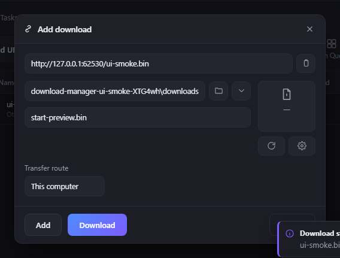
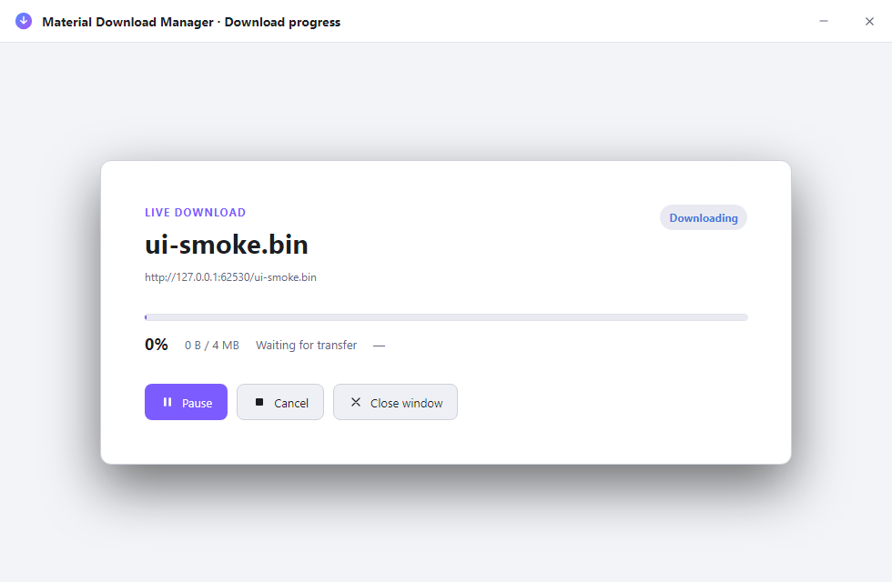
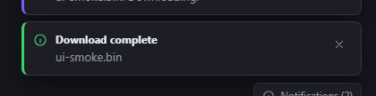

# Separate download progress window

## Behavior

The desktop app opens a second frameless Electron window for one download's
live progress. It has its own title bar, minimize and close controls, a named
accessible progress bar, status, byte count, speed, ETA, and pause/resume and
cancel actions. It reads the same main-process `StateSnapshot` as the primary
window, so the browser extension handoff and the visible progress surface use
one queue and one source of truth. Opening another item retargets the existing
progress window instead of creating duplicate engines.

## Configuration

The renderer route is selected by `?view=progress&progressItem=<id>`. The
preload bridge exposes item-targeted `openProgressWindow`, progress retargeting,
minimize, and close operations. The toolbar and command palette select the
first active item, then fall back to the first stored item. The app refuses to
open a target that is not present in the manager state.

## Failure modes

The main process validates the requesting window/frame and item id before
opening or retargeting the window. A missing target returns `false` and does
not create an orphan surface. State broadcasts update both windows; closing
the progress window does not stop or remove the download. App shutdown closes
the secondary window before the local manager shuts down.

## Security considerations

The secondary window uses the same isolated preload, disabled Node integration,
and trusted-sender checks as the primary window. It receives only typed state
and action channels; URLs and settings remain subject to the main-process
validation boundary. The progress renderer does not open a remote page or
accept a browser-provided target without main-process validation.

## Verification

Run `npm run typecheck`, `npm run build`, `npm run test:electron`, and
`node ui-tests/smoke.mjs` from `design/`. The smoke harness starts a local
fixture, creates a real queued item through the preload bridge, opens the
separate window through the main-process IPC handler, resolves its CDP page
target dynamically, waits for the built page to finish mounting, and rejects
any result without a named `role="progressbar"`. A cheap hidden-desktop capture
must show the primary window and the separately resolved progress window from a
real active download before release verification is complete. The downloading
surface is treated as a top-level layer: the capture requires a visible
`Downloading` status, a named progressbar, and the separate window target. The
same smoke run also captures the pre-submit Add download form and the
completion success toast, so start, active transfer, and completion remain
inspectable as three distinct built-artifact states.

## Capture evidence

These three PNGs were captured from the built desktop artifact by the same
cheap hidden-desktop smoke run. The Add download image is a populated,
submit-ready form before the `Download` action; the progress image is the
separate top-level window while its status reads `Downloading`; the completion
image is the non-blocking success toast after the loopback transfer completes.

| State | Capture | Dimensions | SHA-256 |
| --- | --- | --- | --- |
| Add download before submit |  | 568 × 431 | `c75e7aa7e466f7f6dd2ae3c4fff6b8741fd2f2fd5a456cd2da36d80734db7613` |
| Active Downloading progress window |  | 980 × 640 | `d106d4b894bb3c22641cc088e5e9dbaaf6a89fe9a72103c81d5f742b14047ac2` |
| Download complete toast |  | 420 × 108 | `c80c9e0befc81f748178979d1fa48d5677fb94f1db2f9c08b77fe3167c1133c7` |

## Suggested articles

- [Reliable transfers](./reliable-transfers.md)
- [Chromium extension handoff](../integrations/browser-extension.md)
- [Renderer accessibility](../accessibility/renderer-accessibility.md)
