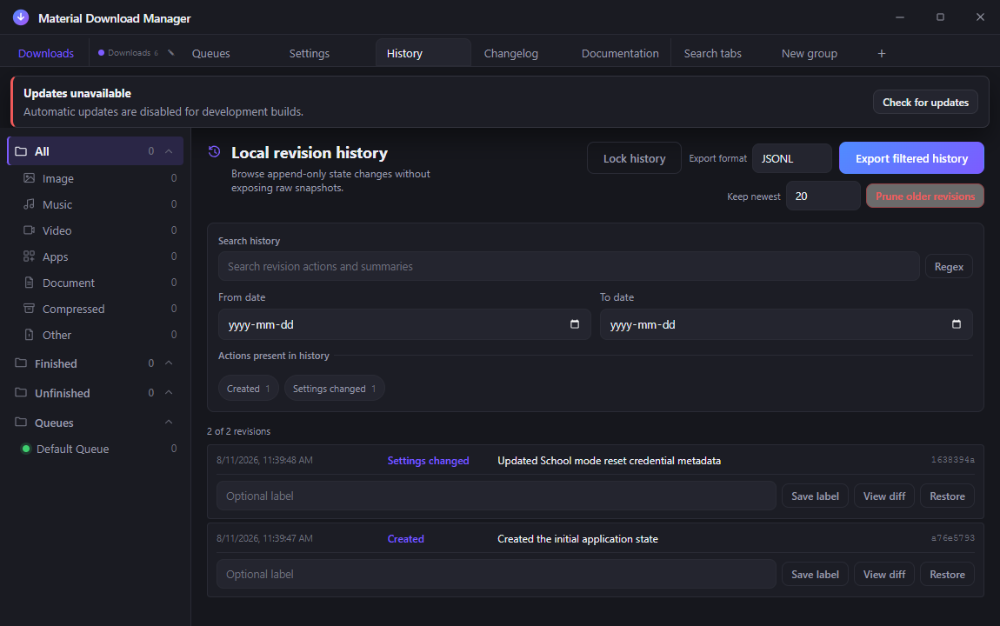
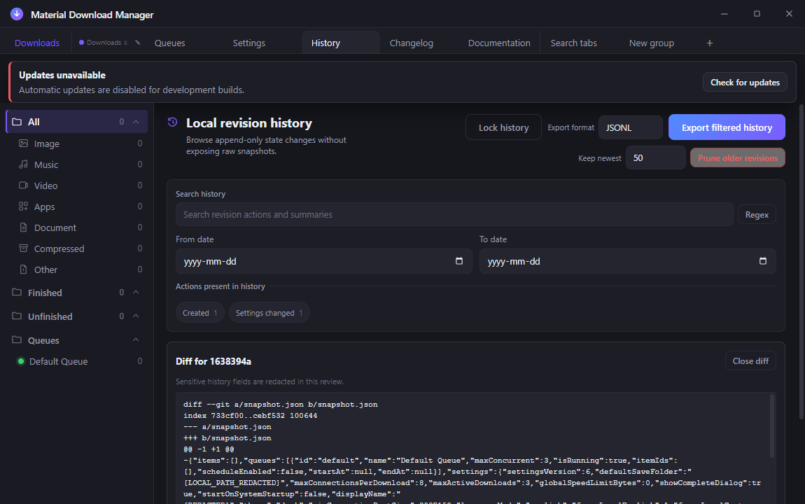
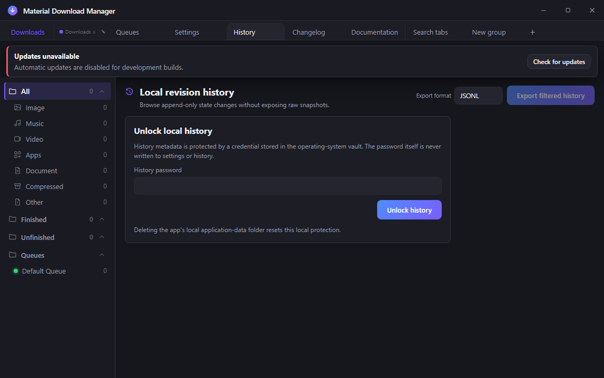

# History browser panel

## Behavior

The Windows application presents local revision metadata in a first-class
History tab beside Downloads, Queues, and Settings. Each row shows the factual
action, summary, timestamp, and short revision identifier. The panel reports
the matching count and distinguishes an empty history from a no-match filter.

The search field is plain-text-first and has an adjacent full JavaScript regex
builder. A date range and action chips compose with the search instead of
replacing it. Action chips come from the actions present in the filtered view,
so the UI does not promise an action that the local history does not contain.

Each revision row also exposes three bounded actions: **View diff** opens a
main-process-generated redacted patch, **Save label** writes or clears a
user-authored label in a sidecar commit, and **Restore** validates and applies
the selected state when no transfer is active. A successful restore is followed
by a new `restored` audit revision; it never rewrites the selected commit.

The header's **Keep newest** control accepts a bounded retention count. **Prune
older revisions** opens the app's blocking two-key confirmation gate because it
changes which state revisions are visible. The operation creates a
`pruned.json` tombstone and a `pruned` audit revision instead of deleting or
rewriting Git history. Label, prune, and protected display-name audit entries
remain visible.

History metadata is visibly protected. On first use the panel asks the user to
create a local password; later launches show an unlock form until the user
enters the matching password. Once unlocked, the panel offers Lock history and
clears its revision view immediately. Export is disabled while locked, and the
panel never requests the history view before the main process reports an
unlocked state. The recovery copy names deletion of the app's local
application-data folder as the reset route.

## Configuration

The active app tab is persisted through the existing versioned tab state. The
renderer requests a bounded `HistoryView` through the validated preload bridge;
the main process normalizes the filter before asking `HistoryStore` for data.
Export format is selected in the panel and the same normalized filter is sent
to the serializer, keeping the file aligned with the visible result.

## Failure modes

An unavailable local history repository becomes an explicit non-blocking panel
state and exposes no revision data. Invalid date ranges, oversized searches,
unknown actions, invalid flags, and unsafe regular expressions are rejected at
the IPC boundary. A regex worker timeout or rejection is preserved as a typed,
localized filter error, associated with the search field, announced in an
accessible alert, and offered a filter Retry action. It never becomes an
ordinary zero-revision result. Export failures use a separate action alert and
their own Retry export action, never mark the search field invalid, and never
claim that a file was written. A successful retry clears only the action error;
the filter and export paths cannot overwrite one another's state.
Diff, label, restore, and retention failures use separate accessible action
notifications. A corrupt sidecar, invalid label, unknown revision, active
transfer, invalid snapshot, or failed restore write is reported without
pretending that the operation completed. Prune confirmation can be cancelled
with Escape or Emergency exit; no tombstone is written until both keys and the
full slider have completed.

## Security considerations

The panel receives revision metadata and bounded redacted diffs only; raw
snapshots and custom request headers never cross into the renderer. Display-name
mutations are represented by a dedicated hash-only history record, so the chosen
name is absent from that record. The broader local `snapshot.json` history remains plaintext metadata;
the password protects access through this UI and is not a claim that those
files are encrypted. Search evaluation is bounded and local. Export uses the
shared escaping and representational-limit warnings, and the history repository
remains isolated from user projects and GitHub remotes.

Restore is deliberately narrower than importing a snapshot: only the public
download fields needed for a dormant item are accepted, live vault-backed source
maps and arbitrary headers are discarded, and the restored state preserves the
current School-mode credential state. The restored state is normalized before a
new audit revision is written, with a separate display-name audit when that
value changes. Diff redaction covers credential-like key names, URL userinfo,
query material, and complete local paths (including paths containing spaces)
before any patch reaches the renderer.

## Verification

`npm run typecheck`, `npm run build`, `npm run test:engine`, and
`npm run test:electron` pass from `design/`. Focused tests also cover the vault
verifier, locked renderer session, redacted display-name record, and rollback
when the required history commit fails. The built-artifact UI smoke records the
History tab, its locked setup/unlock state, two native date controls, search,
export, tab activation, and the separate Settings-tab checks. A cheap Lowlevel
hidden-desktop capture verifies the real application shell and locked History
surface after the protection flow is bundled. The checked-in capture is
[`protected-history-locked.png`](../../screenshots/history/protected-history-locked.png)
and shows the setup form, vault explanation, reset route, and disabled export.
Injected-evaluator tests separately prove genuine zero matches and worker
failures for both views and exports. The built-application smoke also forces an
export validation failure, proves that search remains valid, corrects the
format, retries the exact action, and observes successful recovery.
The history action tests additionally cover redacted diffs, sidecar labels,
append-only restore, protected display-name audit retention, tombstone pruning,
and the unchanged Git commit count proof. Additional restore-hardening tests
prove that tampered snapshots cannot reuse vault-backed source maps or inject
unknown fields, and redaction tests cover token-like keys, URL credentials, and
POSIX paths with spaces.

## Capture evidence

This 1150×720 PNG is a real built Windows desktop capture from the Cheap
headless route. It shows the unlocked History surface, action/date/search
filters, per-revision label/diff/restore actions, and the bounded retention
control. The checked file is
`docs/screenshots/history/history-manager-actions.png` (78,947 bytes) with
SHA-256
`845E8EA17410AF2C4CE95CF3531C03CCB100664C768297746F460CE02BC75115`.

The second 1150×720 PNG drives **View diff** on the real surface and shows the
bounded redacted patch panel. It is 84,295 bytes and its SHA-256 is
`2F7C4290D2809095AC5D463F9DDF4D63C71FF3C3CCAD3A2F7C4CD5D1E6F28930`.

The capture profile was disposable and the hidden desktop and application were
closed after the images were inspected. The images prove visible wiring only;
vault storage and append-only behavior are covered by the focused tests above.

This distinct 1150×720 capture was taken from the built primary application at
source `9344664`. It is 55,603 bytes with SHA-256
`803AEC9BF2A9BB041A1E89EEC88F7F32E068753A718C3E1C156DCC2932723AD9` and shows
the locked History access card, vault explanation, reset route, and disabled
export control. No username, local path, credential, or user-authored display
name appears in the frame.

## Suggested articles

- [Local version history](local-version-history.md)
- [Record export](../export/record-export.md)
- [Regex builder](../search/regex-builder.md)
