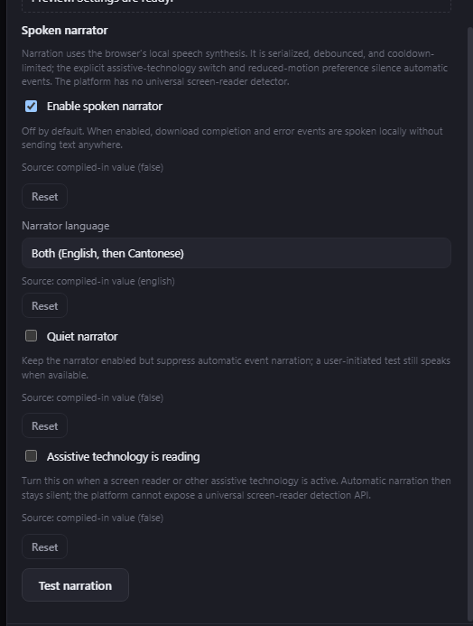

# Spoken narrator

## Behavior

The Windows desktop application includes an opt-in spoken narrator for factual
download completion and error events. It is disabled in a fresh profile. When
enabled, the user chooses English, Hong Kong Cantonese, or Both. Both always
speaks one English segment and then one Cantonese segment; the segments never
overlap.

The narrator uses the renderer's local speech-synthesis API. It does not send
notification text over the network, store audio, or expose a credential. The
queue debounces bursts, keeps only the newest pending event in each category,
and applies a bounded cooldown before repeating an event category. A user test
is marked as user initiated so it can start immediately while queued event
narration remains serialized.

The existing English and Cantonese funny-level sliders style the surrounding
spoken copy independently. They never change the download name, status, error,
or next step. School mode forces English at level 1 and hides the narrator
controls while it is active; the saved narrator choices return when the mode is
turned off.

## Configuration

Open **Settings → Language** and expand **Spoken narrator**. The controls are:

- **Enable spoken narrator** — opt in to local event speech.
- **Narrator language** — English, Hong Kong Cantonese, or Both (English then
  Cantonese).
- **Quiet narrator** — keep the narrator enabled while suppressing automatic
  event speech. The user-initiated test remains available so the local speech
  path can be checked deliberately.
- **Assistive technology active** — an explicit safety switch for a screen
  reader or other assistive-technology session. When it is on, automatic
  narration is suppressed and the setting is persisted. The desktop platform
  does not expose a reliable universal screen-reader detector, so this switch
  is the fail-closed user signal; the renderer accessibility bridge also
  honors an active signal when an integration provides one.
- **Test narration** — queues a bounded local sample through the same serialized
  path without waiting for a download.

The four persisted narrator values are validated by the main process and carry
compiled-in or persisted provenance like the other settings. The defaults are
disabled, English, quiet mode off, and assistive technology inactive. Reset
controls restore those compiled-in values. School mode hides this section and
temporarily disables narration without discarding the saved choices.

## Failure modes and security

If speech synthesis or a usable voice is unavailable, the application remains
usable and the narrator fails non-blockingly; the test and notification surfaces
still report their ordinary text result. Automatic narration yields when the
persisted assistive-technology switch is active, when the renderer bridge
receives an explicit active signal, or when `prefers-reduced-motion: reduce` is
active. Because the platform has no reliable universal screen-reader detector,
the app does not claim automatic detection: users should turn on the safety
switch for their session. A user-initiated test remains an explicit action and
reports a localized warning when speech or a Cantonese voice is unavailable. A
quiet narrator suppresses automatic events without changing persisted language
or funny-level choices.

Each request is bounded to 1,024 normalized characters per language. The queue
has a generation guard, so a late browser speech callback after cancellation,
settings disablement, or window teardown cannot resurrect an old utterance or
advance a new one. No signing, native-messaging host, CRX package, or external
service is involved.

## Verification

Run from `design/`:

```powershell
npm run typecheck
npm run build
node --test --test-timeout=30000 dist-electron/electron/__tests__/narrator.test.js
npm run test:ui -- --narrator-screenshot "..\docs\screenshots\notifications\spoken-narrator.png"
```

The focused narrator tests cover independent language styling, Both ordering,
debounce replacement, category cooldown, user-priority bypass, quiet mode,
the persisted assistive-technology boundary, screen-reader and reduced-motion
suppression, School mode, disabled state, synchronous and asynchronous adapter
failures, and late callback
cancellation. The built UI smoke verifies the four localized controls, their
provenance/reset paths, the user test action, the non-blocking test notification,
the native speech-API and Cantonese-voice-unavailable warning path, and the
real Settings surface. The capture below is taken from that built
application through the approved hidden-desktop route:



The checked PNG is **524×693 pixels**, **43,991 bytes**, and has SHA-256
`28C29158DE84CCA0ED1DCC8BBAA2CE2B0D89BE53EEF1B23A53BE46F0FC8F5C33`. These
values come from the final built-artifact smoke capture and must match the
tracked file and capture manifest. An absent or undecodable capture is a
verification failure, not a skipped feature.

## Suggested articles

- [Notification centre](notification-center.md)
- [Language and appearance settings](../settings/language-and-appearance.md)
- [Renderer accessibility](../accessibility/renderer-accessibility.md)
- [Reliable transfers](../download-engine/reliable-transfers.md)
