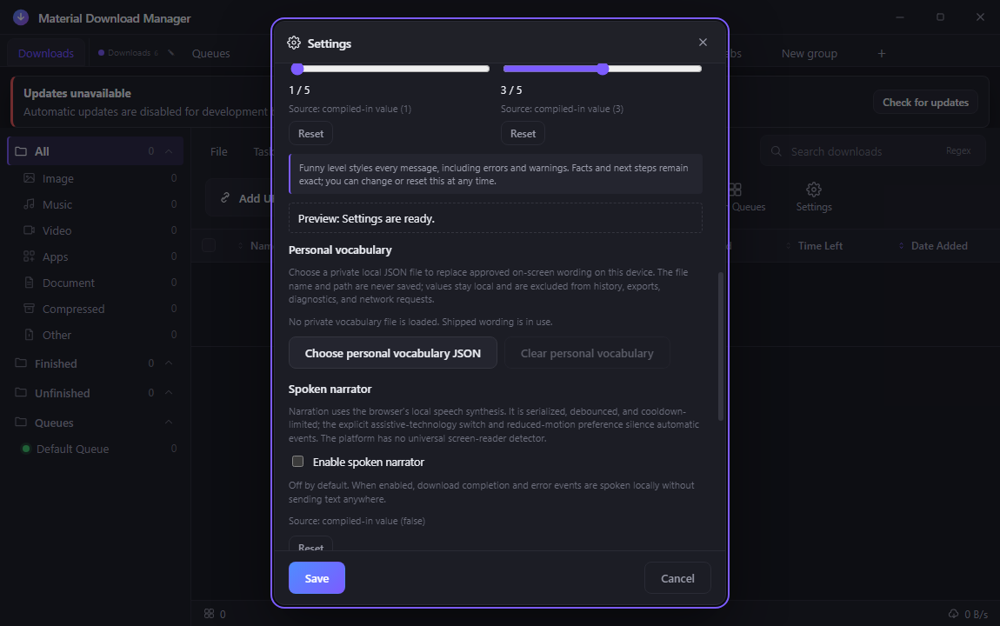

# Personal vocabulary JSON

## Behavior

The Windows desktop app always shows **Personal vocabulary** in the Language
Settings tab while School mode is off. It provides an accessible local JSON
picker, a truthful no-file/loaded/invalid status, a replacement picker, and a
clear action. The status deliberately reports only a bounded entry count and
generic cache state; it never displays the selected filename, path, file
timestamp, or replacement text.

When a complete valid file is selected, its approved literal replacements are
applied once at the renderer's localized user-facing copy boundary. The
transformation is longest-match-first, does not cascade a replacement into a
second replacement, and falls back to the shipped string if the resulting
rendered text would exceed its limit. Commands, URLs, identifiers, code,
paths, download records, exports, and external factual records are not passed
through that boundary.

The control is also indexed by the Language-tab Settings search and its
adjacent anchored Regex builder. The command palette (`Ctrl+Shift+F`) has
separate upload, status, replace, and clear destinations that focus the exact
control. School mode removes the personal-vocabulary controls and search and
palette entries immediately; it restores the prior local cache behavior when
School mode is turned off.

## Local JSON contract

The picker accepts only a user-selected local `.json` file. The complete UTF-8
payload must validate before anything changes. The one supported neutral shape
is:

```json
{
  "schemaVersion": 1,
  "replacements": {
    "<source-string>": "<replacement-string>"
  }
}
```

This is a schema illustration, not a built-in mapping, example vocabulary, or
template. The app ships no replacement data.

Version 1 has these bounded rules:

| Rule | Limit or requirement |
| --- | --- |
| File size | At most 65,536 UTF-8 bytes |
| Top-level fields | Exactly `schemaVersion` and `replacements` |
| Nesting depth | At most 4 JSON levels |
| Entries | At most 128 unique replacements |
| Source key | Non-empty string, at most 128 characters |
| Replacement value | String, possibly empty, at most 256 characters |
| Object safety | Duplicate keys, unsafe prototype keys, arrays, unknown fields, malformed JSON, unsupported versions, controls, and non-string values are rejected |

The privileged picker validates byte size, regular-file state, UTF-8 decoding,
and the full schema before it writes a separate private application-data cache.
It does not trust the file extension alone. A selected file that fails any
check changes nothing partially. If a valid cache already exists, it remains
active after an invalid replacement attempt until the user explicitly clears
it.

## Privacy and persistence

The private cache is separate from `AppSettings`, `StateSnapshot`, and the
DownloadManager persistence path. It is revalidated before use, stored with an
atomic local write, and purged by **Clear personal vocabulary**. No source
filename, source path, or source-file metadata is retained in the status
surface or bridge result.

Private replacement data and file metadata are omitted from normal settings
state, local download history snapshots, history views and exports, diagnostics,
logs, renderer persistence, telemetry, analytics, captures, and network
requests. Ordinary exports and history therefore retain their existing generic
content and do not contain an undeclared personal-vocabulary field. The app
does not contact a network service while selecting, validating, loading,
replacing, clearing, or applying this data.

## Accessibility and localization

The picker and clear buttons are keyboard-operable with unique accessible
names. The helper is associated with both controls, and the state is announced
through a live status or alert region. English, playful Hong Kong-style
Cantonese, and bilingual presentation all keep the privacy and failure facts
unchanged. The funny-level controls are still available around the surface;
they style surrounding UI voice without changing validation or cache facts.
At a 520-CSS-pixel high-scale layout, the controls remain within the Settings
dialog without horizontal overflow.

## Failure modes

- Missing cache: the app uses shipped wording and shows the no-file state.
- Corrupt, stale, malformed, oversized, or unsupported cache: the app fails
  closed to original shipped wording and reports an invalid state without
  exposing parser details or file metadata.
- Rejected candidate: no partial replacement is applied; the previous valid
  local cache remains active when available.
- Picker or local-cache operation unavailable: the renderer retains shipped
  wording and shows a generic local-control failure rather than a path or raw
  error.
- School mode: the feature behaves as if it is not installed in every
  user-facing control, search result, and palette route until the mode is
  turned off through its existing shared unlock route.

## Verification

- [`design/electron/__tests__/personalVocabulary.test.ts`](../../../design/electron/__tests__/personalVocabulary.test.ts)
  covers strict parsing; duplicate/unsafe/unknown/version/size/depth/entry and
  string bounds; literal single-pass replacement; School-mode suppression;
  private-cache reload, invalid replacement rollback, corruption, clear, no
  network/logging path, and the deliberate no-leak negative regression.
- The negative regression deliberately injects a generic private sentinel into
  a candidate state serialization and asserts that the leak detector fails;
  unmodified app state, `DownloadManager.getState()`, settings, exported
  history, and a real local HistoryStore snapshot remain sentinel-free.
- [`design/ui-tests/smoke.mjs`](../../../design/ui-tests/smoke.mjs) opens the
  built Settings surface, checks empty/picker/clear semantics, Settings search
  with its anchored Regex builder, palette teleport, all three language modes,
  both funny-level controls, narrow layout, and School-mode suppression.
- Run from `design/`:

  ```powershell
  npm run docs:bundle:check
  npm run typecheck
  npm run build
  npm run test:electron
  npm run test:ui
  ```

The required real built-artifact capture is intentionally the generic empty
control only. It must not show a selected file, any replacement text, cache
metadata, or personal data.

### Capture evidence



This 1,150×720 PNG was captured from the real built desktop application on an
isolated headless desktop. SHA-256:
`3b48cdca04a431be6ec84236364ef027830f457dba1bf844e222234dd69e33d4`.

## Suggested articles

- [Persisted language and appearance settings](language-and-appearance.md)
- [School mode and dialog emojis](school-mode-and-emoji.md)
- [Regex builder](../search/regex-builder.md)
- [Local version history](../history/local-version-history.md)
