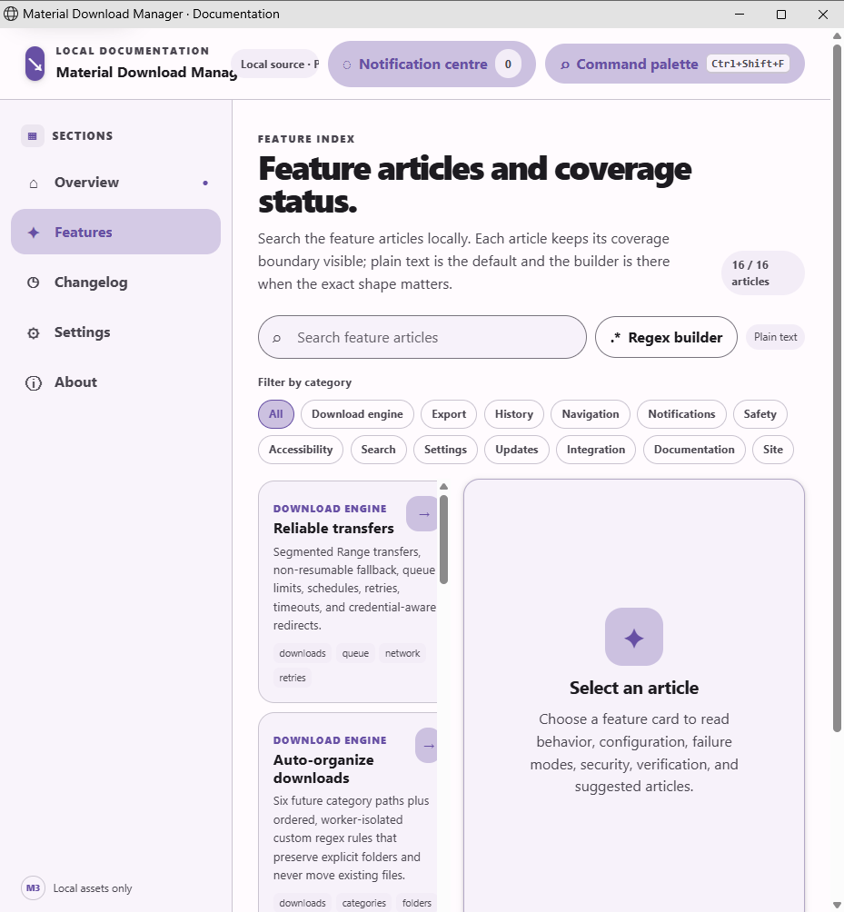
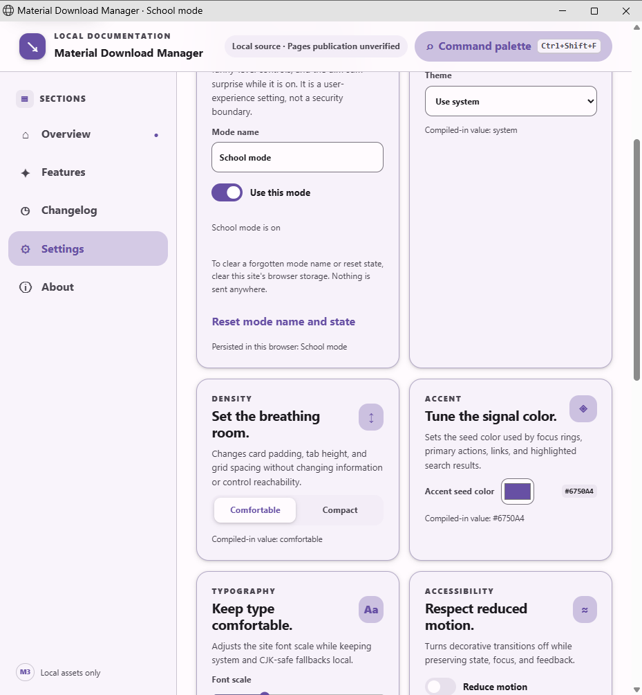

# Universal feature coverage

## Behavior

The Pages source keeps a hand-written inventory at
`site/data/universal-feature-manifest.js`. The inventory names every
user-facing contract that the landing page and documentation site must carry,
the surfaces where it belongs, the article that explains it, and the focused
verification probes that will prove it. The inventory is deliberately separate
from the feature article catalogue: an article can describe a desktop feature
without proving that the Pages surface implements the same contract.

This first foundation slice also adds two persisted site settings. **Show
emojis in messages** controls decorative notification marks only; it never
changes facts, control labels, accessible names, clipboard text, or exports.
The user can rename **School mode** and turn it on or off. While it is on, the
site uses English, removes the Cantonese and funny-level controls, suppresses
playful release and article text, clears notifications, and prevents the dim
sum surprise. Turning it off restores the saved language, funny-level, emoji,
and surprise choices rather than overwriting them.

The notification-centre slice adds a persisted, bounded local history behind
the top-bar launcher. Toasts receive stable IDs, timestamps, bounded text, an
allowlisted tone, and a dismissed state before they disappear. The centre has
its own search and anchored regex builder, status/tone filter, visible-scope
select-all and inverse selection, bulk dismiss, a typed two-control delete
confirmation, JSON export, and keyboard focus return. The universal manifest
still marks the feature `partial`: the full two-key destructive slider,
complete notification-centre bulk surface across every product, and the
real-artifact capture matrix remain open.

## Configuration

Settings use schema version 2 under the `mdm-site-settings-v2` browser-storage
key. A version-1 record is read through an explicit migration path. Only the
known settings are accepted; unknown fields are ignored. School mode stores a
bounded, Unicode-normalized display name and an enabled flag. It stores no
password, PIN, token, or other secret. Clearing this site's browser storage is
the documented reset route, and this user-experience lock is not a security
boundary.

The site listens for newer version-2 storage records from another tab and
applies them atomically when their revision is newer. A malformed or stale
record is ignored. This keeps language, School mode, and emoji changes visible
without a reload while preserving each tab's prior user choices.

## Failure modes

Private browsing or a storage quota refusal leaves the live controls usable but
cannot promise persistence. Invalid stored JSON, unsupported language values,
unbounded names, control characters, and malformed School records fall back to
the shipped values. A School-mode transition never waits on a network request;
it clears the local notification region and hides the local surprise immediately.

The coverage check reports planned and partial contract entries explicitly. It
does not label a missing feature as implemented, and it fails for duplicate
inventory IDs, missing required records, missing verification probes, unsafe
article paths, or absent source anchors for a partial/implemented entry.

## Security considerations

All state remains in the browser's local storage. The mode name is rendered
with DOM text properties after bounded normalization, so it cannot become
markup or script. Decorative emoji are `aria-hidden` and never enter accessible
names. No secrets are persisted, and the reset guidance tells the user exactly
where the local state lives without pretending that it protects data from
someone else who controls the browser profile.

## Verification

Run these commands from the repository root:

```powershell
npm --prefix site run check
npm --prefix site run build
```

The check validates the independent universal inventory, source-level
runtime-anchor probes, schema migration markers, emoji-control wiring,
School-mode state and reset route, and the existing article inventory
separately. The browser smoke matrix for cross-tab storage, keyboard focus,
screen-reader names, narrow layouts, and every future contract entry remains a
required follow-up as each manifest entry moves from planned or partial to
implemented.

## Capture evidence



This capture is from source commit
`a3a7b5840d6c88e6a5f2827328a569f6eaf26da8` at a 929 by 1004 pixel viewport
using the local Pages files on an isolated hidden desktop. The checked PNG is
`docs/screenshots/site/feature-catalogue-coverage.png` with SHA-256
`d5e2f347de788242039436a14d8cff6acd62caf6016a67e0764a8c447ee5d284`.
It shows the feature catalogue’s coverage-aware heading and article count.



This capture is from source commit
`c1dca8ad72fed968b2a233cbc16803577ecff25b` at a 929 by 1004 pixel viewport
using the local Pages files on an isolated hidden desktop. The checked PNG is
`docs/screenshots/site/school-mode-suppression.png` with SHA-256
`1360ddb2d12e795b7284a89666b4f161eefc5dba38790ad15d499fab89c6761b`.
It shows School mode active with the language card and notification-centre
launcher absent from the visible surface.

## Suggested articles

- [Landing and documentation site](./landing-and-documentation-site.md)
- [Language and appearance settings](../settings/language-and-appearance.md)
- [Notification centre](../notifications/notification-center.md)
- [Regex builder](../search/regex-builder.md)
