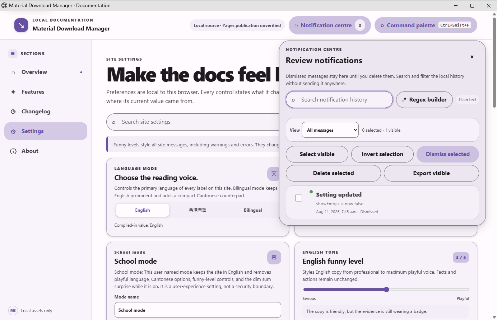

# Material Download Manager site

This directory contains the local-asset landing and documentation surface. It
uses plain browser HTML, CSS, SVG, and JavaScript; it has no runtime package
dependencies, CDN assets, analytics, or network-loaded images.

## Local checks

Run from the repository root:

```powershell
npm --prefix site run check
npm --prefix site run build
```

`check` validates the local asset inventory, article coverage, accessibility
landmarks, regex-builder hooks, release manifest, and stable-installer gate.
`build` runs the same check and copies the serving files to a temporary
directory outside the repository. The output path is printed by the script so
it can be opened by a local static server without adding generated output to
the checkout.

`data/universal-feature-manifest.js` is the hand-written Pages contract
inventory. It is checked separately from the feature article catalogue, keeps
required surfaces and exact verification probes for every contract entry, and
reports planned or partial entries without presenting them as shipped. The
site settings schema also persists the emoji decoration switch and the
user-renamable School mode name/state. School mode is an English-only
user-experience setting: it removes the playful controls and local surprise,
and clearing this site's browser storage is the documented reset route.

The top-bar Notification centre now keeps up to 100 text-only toast records in
browser storage. Dismissed messages remain reviewable, with an independent
search/regex builder, status filter, visible-scope selection and inverse
selection, bulk dismiss, typed delete confirmation, and JSON export. The
manifest continues to mark this universal feature partial while the complete
two-key destructive confirmation and full capture matrix remain outstanding.

## Browser-local file converter

The **Converter** tab is a local browser foundation, not a claim that every
desktop conversion format is available. It has one independently searchable,
plain-text-first regex builder per category:

- Documents/PDF
- Images
- Audio
- Video
- Archives
- Structured Data/Spreadsheets
- Code/Text
- Binary Encodings

The enabled adapters are real browser-local transformations: Canvas-based PNG,
JPEG, and WebP output after browser decoder/encoder validation; UTF-8 line-end
normalization; JSON formatting; CSV-to-JSON and JSON-array-to-CSV; and Base64
encoding/decoding. The catalog explicitly disables PDF manipulation, audio and
video transcoding, archive work, and XLSX/ODS work because this static page does
not bundle the required offline parser, codec, or writer. It never substitutes a
network service, a command-line tool, or a device-installed dependency.

Each file is sniffed from bounded bytes rather than its extension or MIME claim.
The no-total-cap queue keeps runtime `File` references rather than preloading
every source byte; it has bounded concurrency, pause, resume, cancel, retry, and
per-item outcomes. Generated result bytes remain in memory only long enough for
the user to download a fully validated Blob. IndexedDB stores safe queue/result
metadata and history when available, but never source bytes, result bytes,
browser file paths, object URLs, file handles, or external-editor state. A
reloaded record therefore asks for its original file again before it can resume.

The page cannot inspect a chosen download destination, free destination storage,
or launch an external editor. It creates a browser download only after complete
output validation and states that browser boundary in the target review.

### Notification centre capture evidence



This capture was taken from source commit
`a790fe937092c75c0d766365223cc6ed2ea9e95d` at a 1384 by 892 pixel viewport
using the local Pages files on an isolated hidden desktop. The PNG is
`docs/screenshots/site/notification-centre-history.png` and its SHA-256 is
`0fcbb0d1e65eb667bc4b83e3bba20535c518b40196abc16967b054a19872ebce`.
It shows the Settings-triggered toast retained as a dismissed history row,
the local search and regex builder, the status filter, and the bulk controls.


This capture is from source commit
`a3a7b5840d6c88e6a5f2827328a569f6eaf26da8` at a 929 by 1004 pixel viewport
using the local Pages files on an isolated hidden desktop. The PNG is
`docs/screenshots/site/feature-catalogue-coverage.png` and its SHA-256 is
`d5e2f347de788242039436a14d8cff6acd62caf6016a67e0764a8c447ee5d284`.
It shows the feature catalogue’s coverage-aware heading and the article count
without claiming that every universal contract entry is implemented.


This capture is from source commit
`c1dca8ad72fed968b2a233cbc16803577ecff25b` at a 929 by 1004 pixel viewport
using the local Pages files on an isolated hidden desktop. The PNG is
`docs/screenshots/site/school-mode-suppression.png` and its SHA-256 is
`1360ddb2d12e795b7284a89666b4f161eefc5dba38790ad15d499fab89c6761b`.
It shows the user-named School mode active, with the language card and
notification-centre launcher absent from the visible surface.

The site embeds the categorized feature articles so the documentation remains
available without a fetch. The source Markdown remains authoritative in
`docs/features/`; every site article links back to its category article.

## Release and publication honesty

`data/release-manifest.json` and its browser-loaded JavaScript form fail closed
when no stable production release has been proven. The UI creates a stable
installer link only when a manifest record is marked verified, carries a stable
version, uses an HTTPS asset URL, and lists the required Squirrel assets. The
injected manifest also carries the version-stamped Chromium extension ZIP's
name, size, SHA-256, Manifest V3 version, unsigned state, and load-unpacked
installation method only after the latest release exposes matching verified
metadata. A prerelease is never eligible.

The extension release asset is a generic source/reference ZIP. Its pairing
module is intentionally empty, so a fresh copy cannot authenticate protocol-2
handoff until the desktop app prepares a private paired folder. The site directs
users to **Install browser extension** in the app, then **Developer mode → Load
unpacked** with the automatically revealed folder. The repository does not
create or advertise a CRX because a genuine CRX3 requires signing and the
project permanently prohibits signing keys and signing operations.

When the injected stable record passes the browser-side release contract, the
release card also exposes a keyboard- and pointer-accessible **Download
extension source ZIP** action. It shows the exact version, byte count, and SHA-256
digest from `extensionArtifact`, followed by the three-step pairing route:
download/extract, run the desktop app's **Settings → Downloads → Install
browser extension** action, then use **Developer mode → Load unpacked** on the
app-prepared folder. The card carries an explicit unpaired-ZIP warning so the
public archive is never mistaken for the paired handoff. Missing, malformed,
signed, non-GitHub, version-mismatched, digest-mismatched, CRX-bearing, or
otherwise unverified extension metadata leaves the extension action absent;
the installer remains independently governed by its own stable-release
contract.

GitHub Pages publication is not claimed by this source. A real deployment URL
and built-output verification must be added before the repository advertises a
published site.
